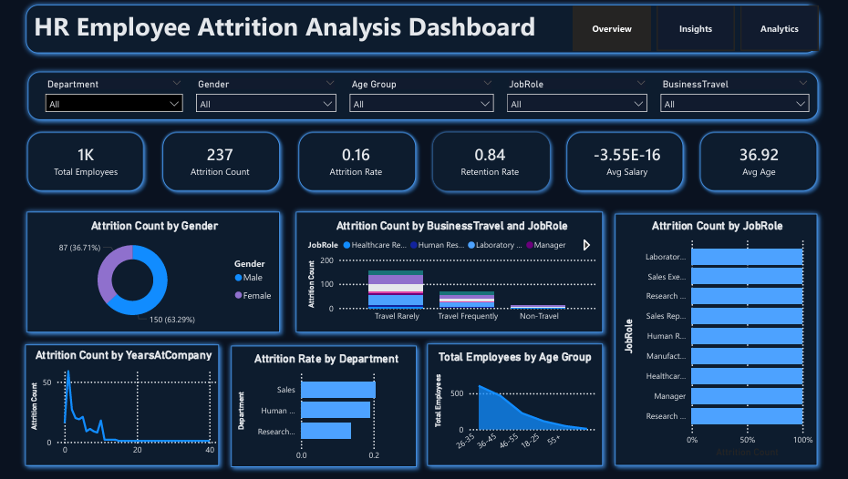

<p align="center">
  
</p>

## HR Employee Attrition Analysis & Interactive Dashboard

An end-to-end **Human Resource Analytics project** that analyzes employee attrition patterns using **Python, SQL, Excel, and Power BI**.  
The goal is to identify key factors influencing employee turnover and provide **data-driven HR insights** to improve employee retention.

---

### Project Overview

Employee attrition is one of the biggest challenges for organizations, leading to:

- Increased hiring costs  
- Loss of experienced talent  
- Reduced productivity  
- Lower employee morale  

This project explores HR data to understand **why employees leave** and builds an **interactive dashboard for decision-making**.

---

### Objectives

- Analyze employee attrition trends  
- Identify key drivers of employee turnover  
- Perform advanced SQL-based HR analysis  
- Build interactive Power BI dashboards  
- Generate actionable business insights  
- Support HR decision-making with data  

---

### Key Business Questions Answered

Which departments have the highest attrition?
Does overtime increase employee turnover?
How does salary affect attrition?
Which age groups are most likely to leave?
What is the impact of job satisfaction on retention?
Which employees are at highest risk?

### Project Workflow

```text
Data Collection
      ↓
Data Cleaning (Python - Pandas)
      ↓
Exploratory Data Analysis (EDA)
      ↓
Feature Engineering
      ↓
SQL Business Analysis (MySQL)
      ↓
Excel KPI Dashboard
      ↓
Power BI Interactive Dashboard
      ↓
Insights & Recommendations

### Data Cleaning & Feature Engineering

Removed duplicate records
Handled missing values
Encoded categorical variables
Standardized column names
Created salary bands, age groups & and other
Built employee risk categories


### Exploratory Data Analysis (EDA)

Key insights explored:

Attrition by Department
Attrition by Salary Level
Attrition by Overtime
Age-wise Attrition Distribution
Gender-based Attrition Patterns
Job Satisfaction vs Attrition

### SQL Business Analytics

Advanced SQL techniques used:

CTEs (Common Table Expressions)
Window Functions
Ranking Functions
Views
Stored Procedures

Key SQL Insights:

Department-wise attrition rate
Salary comparison of employees leaving
Overtime impact on attrition
Age group risk segmentation
Attrition trends by Years at Company
 
### Excel KPI Dashboard

Built an executive-level Excel dashboard with:

KPIs:

Total Employees
Attrition Count
Attrition Rate
Average Salary
Average Age
Average Years at Company
Overtime %

Features:

Pivot Tables
Pivot Charts
Slicers (Interactive Filters)
KPI Cards

### Power BI Dashboard Features

Interactive KPI Cards
Department-wise Attrition Analysis
Salary vs Attrition Insights
Age Group Distribution
Overtime Impact Visualization
Dynamic Filters (Slicers)

### Key Insights

Employees working overtime have higher attrition rates
Lower salary employees are more likely to leave
Sales & R&D departments show higher turnover
Employees with 0–3 years tenure are at highest risk
Younger employees (25–34) have higher attrition tendency

### Business Recommendations

Reduce excessive overtime workload
Improve compensation structure
Strengthen employee engagement programs
Focus on early tenure retention strategies
Improve work-life balance policies
Monitor high-risk departments regularly

### Skills Demonstrated

Data Cleaning & Preprocessing
Exploratory Data Analysis (EDA)
SQL for Business Intelligence
Excel Dashboard Design
Power BI Visualization
Business Storytelling
HR Analytics Understanding

### Project Outcome

This project delivers a complete HR analytics solution that enables organizations to:

Understand employee behavior
Reduce attrition rate
Improve workforce planning
Make data-driven HR decisions

### Future Improvements

Machine Learning-based Attrition Prediction
Real-time HR Analytics Dashboard
Automated Reporting System
AI-powered HR Insights
Cloud Database Integration
